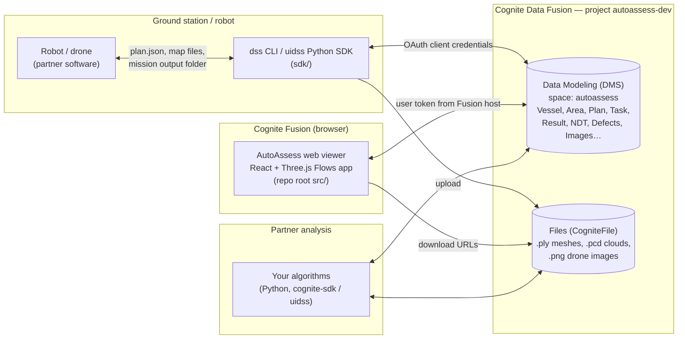

# 1. Architecture & mission lifecycle

## The big picture



Key points:

- **CDF is the only integration point.** The ground station and the web viewer never talk directly. Everything goes through CDF Data Modeling (structured data) and files stored as `CogniteFile` nodes (large binaries).
- **The web app has no backend.** It runs inside Cognite Fusion, which supplies the user's auth token. All logic is in the browser.
- **The ground station uses a service account** (client credentials), configured in `sdk/.env`.

## The mission lifecycle

```mermaid
sequenceDiagram
  actor Insp as Inspector (web)
  participant CDF
  participant GS as Ground station (dss)
  participant R as Robot

  Insp->>CDF: 1. Create InspectionPlan (Draft), pick reference map
  Insp->>CDF: 2. Add tasks (click element / surface in 3D)
  Insp->>CDF: 3. Mark plan Ready (read-only from now on)
  GS->>CDF: 4. dss plan download  →  plan.json
  GS->>CDF: 5. dss plan download-map  →  reference .ply/.pcd
  GS->>R: 6. Hand plan + map to robot (robot decides task order)
  R->>CDF: 7. Mission ends: autoassess_bridge uploads the mesh and creates the campaign (InProgress → Complete)
  GS->>CDF: 8. dss worker (always running) builds the mesh's CDF 3D model
  GS->>CDF: 8b. Other output (UT .csv, ssg.yaml, metrics.yaml, images): dss campaign upload / upload-drone-images
  Insp->>CDF: 9. Review in 3D viewer + campaign report, triage defects; fix the campaign's date or files if needed
  Insp->>CDF: 10. Mark the plan Complete
  Insp->>CDF: 11. Suggestions → new plan for next mission
```

Steps 7 and 8 need nobody at a keyboard. The robot's ROS node `autoassess_bridge` uploads the map when it detects the end of a mission (or when its `~upload_mission` service is called) and creates the campaign itself. `dss worker` notices every new mesh file and builds its 3D model. Without the bridge, `dss campaign upload <folder>` does step 7 by hand. The plan stays Ready until an inspector marks it Complete.

Vocabulary you'll hear:

| Term | Meaning |
|---|---|
| **Vessel** | A ship. Top-level entity. |
| **Area** | A confined space on a vessel (e.g. a ballast water tank `BWT` or cargo hold `CH`). All 3D data is per area. |
| **Inspection plan** | A set of tasks for one area. Status `Draft` → `Ready` → `Complete`. |
| **Task** | *Element task* (inspect a structural element, e.g. a manhole) or *region task* (inspect a surface point with normal + radius). Inspection type `visual` or `ndt_thickness`. |
| **Campaign** / **Inspection result** | One executed mission. Lists the uploaded map files (editable in the viewer) and holds all measured data. Stored as `InspectionResult` nodes. |
| **Reference map** | A completed campaign that a new plan's coordinates refer to. The robot localises against it. |
| **Structural element** | A labelled semantic object in the area (manhole, longitudinal, wall, compartment), produced by the scene-graph (`ssg.yaml`). |

## Repo layout

```
autoassess-ui-dss/
├── src/                        # Web viewer (TypeScript/React)
│   ├── App.tsx                 # Routes
│   ├── shared/cdf/dataModel.ts # ★ Authoritative CDF identifiers (space/views/containers)
│   ├── features/vessels/       # Vessel list + settings
│   ├── features/areas/         # Area list + settings
│   ├── features/viewer/        # 3D viewer, layers, plans, defects, all CDF services
│   ├── features/reports/       # Area & campaign reports
│   ├── features/recommendations/ # Suggested follow-up tasks
│   └── __mocks__/              # Test data factories
├── scripts/                    # Data model setup + seed scripts (setup-dm.ts, upload-3d.ts, …)
├── app.json / manifest.json    # Flows app deploy config + CSP network permissions
├── PRD.md                      # Product requirements
└── sdk/                        # Ground-station Python project
    ├── src/uidss/
    │   ├── cli/                # `dss` CLI (Typer)
    │   ├── services/           # One service per CDF entity
    │   ├── cdf/data_model.py   # Mirror of src/shared/cdf/dataModel.ts
    │   ├── client.py           # UidssClient facade
    │   ├── models.py           # Domain dataclasses
    │   └── config.py, auth.py  # .env settings, CDF auth
    ├── scripts/                # Data model migrations
    └── tests/                  # unit/, integration/, fixtures/ (sample mission files!)
```

**Next:** [2. The CDF data model →](02-data-model.md)
