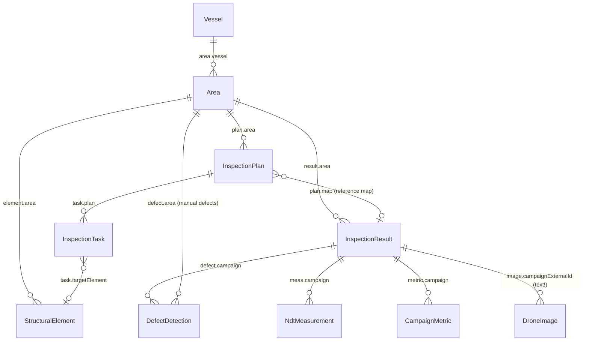

# 2. The CDF data model

All structured data lives in **CDF Data Modeling (DMS)** in one space: **`autoassess`**. Large binaries (meshes, point clouds, images) are **`CogniteFile`** nodes (data-modeling files), referenced from our nodes by their numeric file ID.

> **Source of truth**
> - Identifiers (space, view/container IDs, versions): [`src/shared/cdf/dataModel.ts`](../../src/shared/cdf/dataModel.ts)
> - Full property schemas: [`scripts/setup-dm.ts`](../../scripts/setup-dm.ts) plus migrations in [`sdk/scripts/`](../../sdk/scripts)
> - Python mirror (kept in sync by hand): [`sdk/src/uidss/cdf/data_model.py`](../../sdk/src/uidss/cdf/data_model.py)
> - Design rationale: [`PRD.md` §6](../../PRD.md)

## Entity relationships



Every arrow is a **direct relation** (`{space, externalId}`) pointing from child to parent, except **DroneImage**, which links to its campaign through a plain text property `campaignExternalId`.

## Views and key properties

| View (version) | Key properties | Notes |
|---|---|---|
| **VesselView** (v2) | `name`, `description`, `vesselType`, `deletedAt` | Soft-deleted when `deletedAt` is set |
| **AreaView** (v4) | `vessel`→Vessel, `name`, `areaType` (e.g. `BWT`, `CH`), `groundPlane` [3], `initialCameraPosition` [3], `initialCameraTarget` [3], `deletedAt` | Camera defaults are set from the viewer's area settings |
| **StructuralElementView** (v1) | `area`→Area, `elementType` (`manhole`\|`longitudinal`\|`wall`\|`compartment`), `label` (int, `1000*class + id`), `centerX/Y/Z` | Centre point only, no bounding box yet |
| **InspectionPlanView** (v4) | `area`→Area, `map`→InspectionResult, `status` (`Draft`\|`Ready`\|`Complete`), `name`, `description`, `deletedAt` | `map` can only be changed while the plan is Draft |
| **InspectionTaskView** (v1) | `plan`→Plan, `taskType` (`element`\|`region`), `inspectionType` (`visual`\|`ndt_thickness`), `targetElement`→StructuralElement, `position3d` [3], `normalVector` [3], `radiusM` (default 0.3), `suggestionId` | Element tasks use `targetElement`, region tasks use position/normal/radius |
| **InspectionResultView** (v1) — the "campaign" | `area`→Area, `campaignDate` (date), `status` (`InProgress`\|`Complete`), `cdfFileIds` [int64] (PLY), `pcdFileIds` [int64], `pcdFileLabels` [text] | `pcdFileLabels[i]` is the label for `pcdFileIds[i]` |
| **DefectDetectionView** (v1) | `campaign`→Result, `area`→Area, `probability` (0–1), `defectClass`, `boundingBox3d` [9], `normal3d` [3], `status` (`New`\|`UnderReview`\|`Confirmed`\|`Dismissed`), `source` (`ml`\|`manual`) | `boundingBox3d` = `[cx,cy,cz, hx,hy,hz, rx,ry,rz]` (centre, half-extents, Euler angles in rad) |
| **NdtMeasurementView** (v1) | `campaign`→Result, `position3d` [3], `thicknessMm`, `timestamp` (ISO text) | One node per UT reading |
| **CampaignMetricView** (v1) | `campaign`→Result, `name`, `value`, `unit` (`decimal`\|`percentage`) | Shown as stat cards in the campaign report |
| **DroneImageView** (v2) | `campaignExternalId` (text), `frameId`, `timestamp` (s), `positionX/Y/Z`, `orientQx/y/z/w`, `cdfFileId`, `bboxMin/MaxX/Y/Z`, `focalLengthX/Y`, `principalPointX/Y`, `imageWidth/Height`, `nearPlane`, `farPlane` | Camera pose in the mesh world frame + pinhole intrinsics |

**Coordinates:** everything 3D (element centres, task positions, NDT positions, defect boxes, camera poses) is in the **world frame of the campaign's map files**, in metres. A plan's coordinates are expressed in the frame of its `map` campaign.

## Files API vs Data Modeling (read this, it's the non-obvious part)

**Rule: every file is a `CogniteFile`** (a data-modeling file, view `cdf_cdm:CogniteFile/v1`). Never create classic Files-API-only files. The SDK does this for you. In your own code, create the node first, then upload the content by instance ID:

```python
from cognite.client.data_classes.data_modeling import NodeId
from cognite.client.data_classes.data_modeling.cdm.v1 import CogniteFileApply

cdf.data_modeling.instances.apply(nodes=[CogniteFileApply(
    space="autoassess", external_id="ntnu-file-…", name="score.pcd",
    mime_type="application/octet-stream", tags=["autoassess", "pcd_pointcloud"])])
meta = cdf.files.upload_content("score.pcd", instance_id=NodeId("autoassess", "ntnu-file-…"))
file_id = meta.id   # numeric id, this is what goes into cdfFileIds / pcdFileIds
```

(`uidss.services.cognite_file.upload_cognite_file` wraps exactly this.)

How files and data-model nodes are linked, which surprises people:

- **A CogniteFile has both an instance ID and a numeric file ID.** The instance ID is `{space, externalId}`; CDF also assigns every file a numeric `id`.
- **Our views reference files by that numeric ID in plain `int64` properties**, not by direct relations: `InspectionResult.cdfFileIds[]` (PLY), `pcdFileIds[]` (PCD) and `DroneImage.cdfFileId`. Nothing enforces these links: a file can exist without being referenced (an orphan), and an ID can point to a deleted file. Numeric IDs are always ≤ 2^53−1, so they are exact as JavaScript numbers.
- **A file only "belongs" to a campaign if its ID is in that campaign's list.** Uploading a file doesn't attach it. `dss campaign upload` uploads and then updates the lists. In your own code you must call `campaigns.update_file_ids(...)` yourself.
- **Tags find files, the ID lists link them.** The SDK tags files `["autoassess", "ply_mesh" | "pcd_pointcloud" | "drone_image", "area:<id>" | "campaign:<id>", "label:<label>"]`. `dss worker` finds new meshes by `ply_mesh`, and the viewer's edit-campaign dialog lists an area's files by `area:<id>`. Which campaign a file belongs to is still only the `InspectionResult`'s ID lists.
- **Every PLY/PCD upload creates a new file** (unique external ID `{area}-file-{random}-{name}`). Uploading the same `mesh.ply` twice gives two files. Always resolve files by ID, never by name.
- **Legacy data:** files uploaded before the CogniteFile switch (and by `scripts/upload-3d.ts`, which still uses the classic API) are classic files with no instance ID. They still work by numeric ID, but don't create new ones.
- **The web app downloads by numeric ID** (`files.getDownloadUrls([{ id }])`). The URLs expire, which is why the viewer refreshes them every 50 minutes.

Other DM quirks:
- There is **no DataModel resource**, only containers and views in the `autoassess` space. In Fusion's data-modeling UI, look at the views directly.
- **Old view versions still exist** (e.g. `AreaView` v1–v4, `InspectionPlanView` v1–v4). Always read and write through the versions in `dataModel.ts`. Older versions don't expose newer properties, such as a plan's `map`.
- A legacy `CampaignView` / `CampaignContainer` exists in the space but isn't used by any code. The campaign concept is `InspectionResultView`.
- Filters use **container** property paths, while reads go through **views** (see below).

## 3D models (Core DM)

The viewer renders meshes as **CDF 3D models** streamed by Cognite Reveal, not the raw PLY. **Every mesh file gets its own model**, keyed by the mesh CogniteFile's external id `{file}`. `dss worker` (or `dss campaign build-3d-model`) writes:

| Resource | Id | Contents |
|---|---|---|
| CogniteFile | `{file}-cad-source` | OBJ + MTL (+ textures) zip, the source of the 3D revision |
| CogniteFile | `{file}-collision-proxy` | Decimated binary PLY (≤ 200k faces), used for picking and surface normals |
| 3D model + revision | numeric ids | Created with the 3D API from the zip's numeric file id |
| `CogniteCADModel` node | `{file}-cad-model` | `tags` hold `sourceFileId:<id>`, `area:<id>`, `threeDModelId:<id>` and `collisionProxyFileId:<id>`; `description` holds JSON: the segment-colour `palette`, `hasTexture`, and (when segments are named) a `legend` of colour hex → class name |
| `CogniteCADRevision` node | `{file}-cad-revision` | `revisionId`, `status`, `model3D` → the model node |

If `{file}` plus the suffix is longer than 255 characters, `{file}` is cut to fit (`derived_id` in the SDK, `derivedId` in the viewer). `CogniteCADModel` has no property for the classic 3D model id, which is why it's in the tags.

**A campaign shows the models of the files it lists now.** The viewer resolves each id in `cdfFileIds` to its CogniteFile and looks up `{file}-cad-model`. Moving a file to another campaign, merging two campaigns or changing the date only edits the campaign node; no model is rebuilt.

**Legacy models.** Models built before per-file models are keyed by campaign: `{campaign}-cad-model` / `{campaign}-cad-revision`, merging all the campaign's meshes. They are left as they are. The viewer shows one for the campaign's meshes that have no model of their own and were uploaded before it (and for classic files, which can't get one). `dss worker` skips those meshes too. A mesh added to such a campaign later gets its own model.

Also, the `CogniteCADRevision` view only matches nodes whose `cdf_cdm_3d:Cognite3DModel.type` is `"CAD"`, set on the revision node itself. `dss` writes that; if you create these nodes yourself, write it too, or the viewer won't find them.

## External-ID conventions

| Entity | Pattern | Created by |
|---|---|---|
| Plan | `plan-{uuid}` | Web app |
| Campaign | `result-{uuid4}` | `dss` / `campaigns.create` |
| Structural element | `{areaExternalId}-elem-{label}` | `dss campaign upload` (from `ssg.yaml`) |
| NDT measurement | `{campaignExternalId}-meas-{0000}` | `dss campaign upload` (from CSV) |
| Campaign metric | `{campaignExternalId}-metric-{slug}` | `dss campaign upload` (from `metrics.yaml`) |
| Drone image | `drone-image-{campaignExternalId}-frame-{n}` | `dss campaign upload-drone-images` |

Using deterministic IDs means re-uploading **upserts** (overwrites) rather than duplicating.

## How to read a node's properties

DMS returns properties nested as `properties[space]["ViewExternalId/version"][prop]`:

```json
{
  "instanceType": "node",
  "space": "autoassess",
  "externalId": "result-3f2a…",
  "properties": {
    "autoassess": {
      "InspectionResultView/1": {
        "area": { "space": "autoassess", "externalId": "area-01581" },
        "campaignDate": "2026-09-01",
        "status": "Complete",
        "cdfFileIds": [123456789],
        "pcdFileIds": [987654321],
        "pcdFileLabels": ["Semantics"]
      }
    }
  }
}
```

Filters use **container** property paths: `["autoassess", "InspectionResultContainer", "area"]`. Helpers for both exist on each side:
- TS: `getViewKey(view)`, `getContainerProperty(container, prop)` in `src/shared/cdf/dataModel.ts`
- Python: `view_key(view)`, `container_property(container, prop)`, `view_id(view)` in `uidss.cdf.data_model`

## Changing the data model

Only the AutoAssess team changes the schema in the shared project. If you need a new property or view during integration week, **ask first** ([chapter 8](08-gotchas-and-faq.md#shared-project-etiquette)). The process is:
1. Update `scripts/setup-dm.ts` (containers + a **new view version**; never mutate an existing view version)
2. Bump the version in `src/shared/cdf/dataModel.ts`
3. Mirror it in `sdk/src/uidss/cdf/data_model.py`
4. For existing projects, add a migration script in `sdk/scripts/` (see `migrate_inspection_plan_map_2026_08_26.py` for the pattern, including a `--check` dry run)

**Next:** [3. Setup & credentials →](03-setup-credentials.md)
