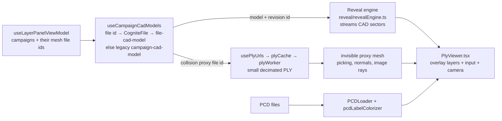

# 5. Track B: Web viewer (run it and add a feature)

The web viewer is a **Cognite Flows app**: a static React single-page app that runs inside Cognite Fusion. Fusion provides the logged-in user's CDF token, so the app has **no backend and no `.env`**.

| | |
|---|---|
| Framework | React 19, react-router 7 (`HashRouter`), Vite 7, TypeScript 5 |
| Server state | TanStack Query 5 (`useQuery` / `useMutation`) |
| UI state | Zustand 5 stores (viewer settings, layer visibility, active plan…) |
| 3D | three.js 0.180 (custom viewer; no Reveal) |
| CDF | `@cognite/sdk` 10 + `@cognite/app-sdk` (auth / Fusion host bridge) |
| UI kit | `@cognite/aura` + Tailwind 4, icons `@tabler/icons-react`, charts `recharts` |
| Tests | Vitest 2 + Testing Library + happy-dom |

---

## Part 1: Run it locally

```bash
# repo root
npm install
npm run dev
```

The dev server runs on **https://localhost:3001** (a local certificate is generated by `vite-plugin-mkcert`; accept it once). `fusionOpenPlugin()` from `@cognite/app-sdk/vite` (in [`vite.config.ts`](../../vite.config.ts)) opens the local dev server inside Fusion; watch the terminal output for the Fusion URL. **Use the Fusion URL**, not localhost directly, because the app needs the Fusion host for auth. Log in to the `cog-autoassess` org.

✅ You should see the **vessel list**. Opening `http://localhost:3001` directly gives "Failed to connect to Fusion"; that's expected.

### Tour of the app

| Route (`src/App.tsx`) | Page | Code |
|---|---|---|
| `/` | Vessel list | `src/features/vessels/` |
| `/vessels/:vesselId/areas` | Area list | `src/features/areas/` |
| `/vessels/:vesselId/areas/:areaId` | **3D viewer** | `src/features/viewer/ViewerPage.tsx` |
| `/vessels/:vesselId/areas/:areaId/report` | Area report (NDT box plots over campaigns, defect summary) | `src/features/reports/AreaReportPage.tsx` |
| `/vessels/:vesselId/areas/:areaId/report/:campaignId` | Campaign report (stats, NDT table, image grid) | `src/features/reports/CampaignReportPage.tsx` |
| `…/settings` | Vessel / area settings | `features/vessels`, `features/areas` |

In the viewer, try:
1. **Layers** tab (right panel): toggle mesh / point clouds / NDT / images / structural elements per campaign.
2. Click a structural element or surface. The **Selection panel** (left) shows details.
3. **Plans** tab: create a plan (choose reference map), make it active, then use "add to active plan" from the selection panel. Toggle Draft ↔ Ready.
4. **Defects** tab: fly to, change status, delete; create a manual defect from a surface click.
5. Click a drone image marker to see the photo. Hovering over it casts a ray into the 3D scene.
6. **Edit a campaign**: in the Layers tab, open a campaign's **⋮** menu → **Edit campaign** (see below).
7. **Suggestions** (on a Draft plan): recommended follow-up tasks from [`src/features/recommendations/recommendationRules.ts`](../../src/features/recommendations/recommendationRules.ts) (for example, NDT readings < 10 mm and Confirmed defects).

### Editing campaigns

A campaign is only a date plus lists of file ids, so you can change it after the upload:

- **⋮ → Edit campaign** changes the **date** and **which uploaded files belong to it**. The dialog lists every mesh and point cloud uploaded to the area (CogniteFiles tagged `area:<id>`), the campaign they're in now, and each mesh's 3D model state: *3D model ready*, *processing*, *waiting for dss worker*, or *in the campaign's 3D model* (a legacy campaign-keyed model).
- **New campaign from files** (below the campaign list) makes a campaign out of the files you pick, for example files the robot uploaded that should be split into two missions.
- **A file belongs to one campaign.** Picking a file that another campaign has moves it: saving removes it from the other campaign in the same write. Its 3D model moves with it, since models belong to files, not campaigns ([chapter 2](02-data-model.md#3d-models-core-dm)).
- Saving only upserts the campaign nodes' `campaignDate`, `cdfFileIds`, `pcdFileIds` and `pcdFileLabels` (new campaigns also get `area`, `status: Complete` and `createdBy: autoassess-web`). Files and 3D models are never changed or deleted.
- A campaign can't be renamed: its external id is its identity, and campaigns have no name (the viewer shows "Campaign <date>"). Change the date, or make a new campaign from its files.

Code: `src/features/viewer/campaigns/` (`useEditCampaignViewModel`, `EditCampaignDialog`, the pure `planCampaignSave`, `AreaFileService`).

### Sharing a view

Copy the browser's address bar and send it. The app keeps its route (vessel, area, report, campaign) and the current 3D camera view (`?camera=`, updated whenever the camera comes to rest) in Fusion's URL, as `customAppInternalState`. Anyone with access who opens the link lands on the same screen and view. Layer toggles and the current selection are per browser and aren't included.

### How 3D loading works

The meshes are **CDF 3D models streamed by [Cognite Reveal](https://www.npmjs.com/package/@cognite/reveal)**: the first geometry appears in 1–2 s instead of after downloading and parsing a 100–270 MB PLY. Everything else (layers, picking, camera controls) is the app's own three.js code, rendered inside Reveal's scene.



- `PlyViewer` owns the camera, controls, fly-to and all overlay layers. `reveal/ExternalCameraManager.ts` hands its camera to Reveal, and the overlays are added with `viewer.addObject3D`.
- Reveal's picking returns no surface normals, so double-click picking, the hover ring and image-pixel rays ray-cast the **collision proxy** (never drawn).
- Colour modes: *Colorization* shows the baked camera texture, or a flat colour for meshes without camera RGB; *Defects* shows the segment colours (the CAD nodes are styled by name).
- A campaign shows one model per mesh file it lists (plus its legacy campaign model for older meshes). Only campaigns whose Mesh toggle is on are streamed.
- Meshes without a model yet show a notice ("3D model being built by `dss worker`", with the `dss campaign build-3d-model` command as a fallback); the viewer polls every 30 s and shows the model when it's there. An area with no mesh at all says "No scan data yet".
- PCD point clouds are still loaded client-side. Reveal's point-cloud decoder needs `connect-src data:`, which the Flows CSP doesn't allow.
- Layers: `MeshLayer`, `SemanticLayer`, `NdtMeasurementLayer`, `PlanTasksLayer`, `ImageLayer`, `DefectDetectionLayer`, `SelectionLayer` (all in `src/features/viewer/`).
- The initial camera comes from the area's `initialCameraPosition` / `initialCameraTarget` / `groundPlane`.

---

## Part 2: Architecture rules (read before coding)

These are enforced in review. Full text is in [`CLAUDE.md` / `AGENTS.md`](../../AGENTS.md).

1. **Services = interface + class.** For example, `CampaignMetricService` (interface) and `CdfCampaignMetricService` (class wrapping `CogniteClient`). Never import the class outside its own file, except from the hook that constructs it.
2. **Data hooks** wrap services in React Query (`useCampaignMetrics`, `useStructuralElements`, …) and get the client from `useCogniteSdk()`.
3. **ViewModel hooks** (`use<Name>ViewModel`) hold all logic. **Components only render.**
4. **Dependency injection through React context.** Each ViewModel exports a `…Context` whose default value is the real hooks. Tests provide fakes, so you rarely need `vi.mock`.
5. **Test first.** Every new module with logic gets a `*.test.ts(x)` next to it.
6. **TypeScript:** no `any`, no `as unknown as T`.

A good reference to copy: [`src/features/viewer/CampaignMetricService.ts`](../../src/features/viewer/CampaignMetricService.ts), then [`src/features/reports/useCampaignMetrics.ts`](../../src/features/reports/useCampaignMetrics.ts), then [`useCampaignReportViewModel.ts`](../../src/features/reports/useCampaignReportViewModel.ts), then `CampaignReportPage.tsx`, each with its test.

---

## Part 3: Worked example ("Structural elements by type" on the area report)

**Goal:** the area report shows how many structural elements of each type (manhole, longitudinal, …) the area has. It follows the full pattern (pure logic, then ViewModel, then View) and reuses the existing `useStructuralElements` hook.

### Step 1: Pure helper, test first

`src/features/reports/elementStats.test.ts`
```ts
import { describe, it, expect } from 'vitest';

import type { StructuralElement } from '../viewer/StructuralElementService';

import { countElementsByType } from './elementStats';

describe(countElementsByType.name, () => {
  it('should return an empty list for no elements', () => {
    expect(countElementsByType([])).toEqual([]);
  });

  it('should count elements per type, sorted by type', () => {
    const elements = [makeElement('wall'), makeElement('manhole'), makeElement('wall')];

    const result = countElementsByType(elements);

    expect(result).toEqual([
      { elementType: 'manhole', count: 1 },
      { elementType: 'wall', count: 2 },
    ]);
  });
});

function makeElement(elementType: StructuralElement['elementType']): StructuralElement {
  return {
    space: 'autoassess',
    externalId: `el-${Math.random()}`,
    elementType,
    label: 0,
    center: [0, 0, 0],
    areaExternalId: 'area-1',
  };
}
```

Run `npx vitest src/features/reports/elementStats.test.ts`. ❌ It fails because the helper doesn't exist yet. Good.

`src/features/reports/elementStats.ts`
```ts
import type { StructuralElement } from '../viewer/StructuralElementService';

export interface ElementTypeCount {
  elementType: StructuralElement['elementType'];
  count: number;
}

export function countElementsByType(elements: StructuralElement[]): ElementTypeCount[] {
  const counts = new Map<StructuralElement['elementType'], number>();
  for (const e of elements) counts.set(e.elementType, (counts.get(e.elementType) ?? 0) + 1);
  return Array.from(counts, ([elementType, count]) => ({ elementType, count })).sort((a, b) =>
    a.elementType.localeCompare(b.elementType),
  );
}
```
✅ The test passes.

### Step 2: Extend the ViewModel through DI

In [`src/features/reports/useAreaReportViewModel.ts`](../../src/features/reports/useAreaReportViewModel.ts):

```ts
import { useStructuralElements } from '../viewer/useStructuralElements';
import type { StructuralElement } from '../viewer/StructuralElementService';
import { countElementsByType } from './elementStats';
import type { ElementTypeCount } from './elementStats';

// 1. add to the view model interface
export interface AreaReportViewModel {
  // …existing fields
  elementCounts: ElementTypeCount[];
}

// 2. add the dependency type + default
type UseStructuralElementsFn = (
  areaSpace: string,
  areaExternalId: string,
) => UseQueryResult<StructuralElement[], Error>;

export type AreaReportViewModelContextType = {
  // …existing deps
  useStructuralElements: UseStructuralElementsFn;
};

const defaultDeps: AreaReportViewModelContextType = {
  // …existing deps
  useStructuralElements,
};

// 3. inside useAreaReportViewModel()
const { /* … */ useStructuralElements: useElementsDep } = useContext(AreaReportViewModelContext);
const elementsQuery = useElementsDep(areaSpace, areaExternalId);
const elementCounts = useMemo(() => countElementsByType(elementsQuery.data ?? []), [elementsQuery.data]);
// include elementsQuery.isLoading / .error in isLoading / error, and return elementCounts
```

Then update [`useAreaReportViewModel.test.ts`](../../src/features/reports/useAreaReportViewModel.test.ts): add a `useStructuralElements: vi.fn(() => …)` fake to the mock context and add one test asserting `elementCounts`. TypeScript will point out every place the context type is now incomplete.

### Step 3: Render it

In `AreaReportPage.tsx`, read `elementCounts` from the view model and render a small table or stat cards next to the defect summary. Use `@cognite/aura` components and see the existing defect-summary markup for styling. Add a render test in `AreaReportPage.test.tsx` ("shows element counts").

### Step 4: Check everything

```bash
npm test          # all Vitest tests
npx eslint src/features/reports   # lint what you touched (see note)
npm run build     # tsc + vite build
```
✅ Tests, lint on your files and build pass, and the report page shows the new section after a reload.

> Note: `npm run lint` on the whole repo currently reports existing import-order issues in files unrelated to this tutorial, so lint the folders you change.

### Ideas for your own features

- New **layer** in the viewer for your data type: implement `IViewerLayer` (see `NdtMeasurementLayer.ts`), add a `LayerType`, and add a toggle in `useLayerPanelViewModel`.
- New **report** widget: follow Part 3.
- New **recommendation rule**: `src/features/recommendations/recommendationRules.ts` (pure functions, easy to test).
- Show your **ML defects** (from [chapter 6](06-analysis-on-cdf-data.md)): they already appear in the Defects tab if you write `DefectDetection` nodes.

---

## Part 4: Deploying

`npm run deploy` runs `npx @cognite/cli@latest apps deploy --interactive` using [`app.json`](../../app.json) (app `autoassess-uidss`, project `autoassess-dev`). **Don't deploy to the shared project yourself**: it replaces the version everyone else is using. Develop against `npm run dev` and ask the AutoAssess team to deploy.

If the app needs to load from a new external host (images, APIs), add it to the network permissions in [`manifest.json`](../../manifest.json). Otherwise the Content Security Policy blocks it.

**Next:** [7. End-to-end exercise →](07-end-to-end-exercise.md)
