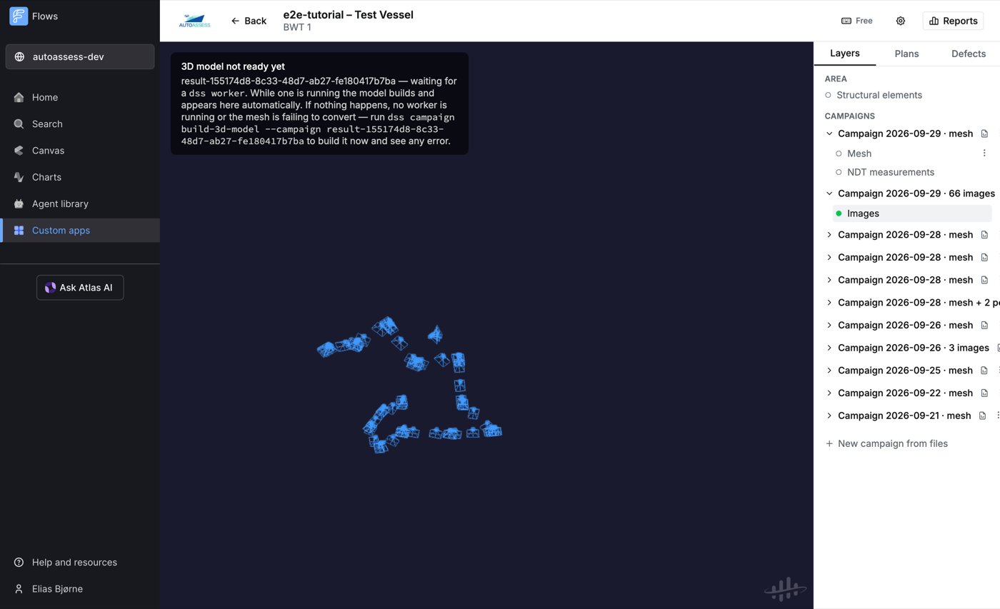
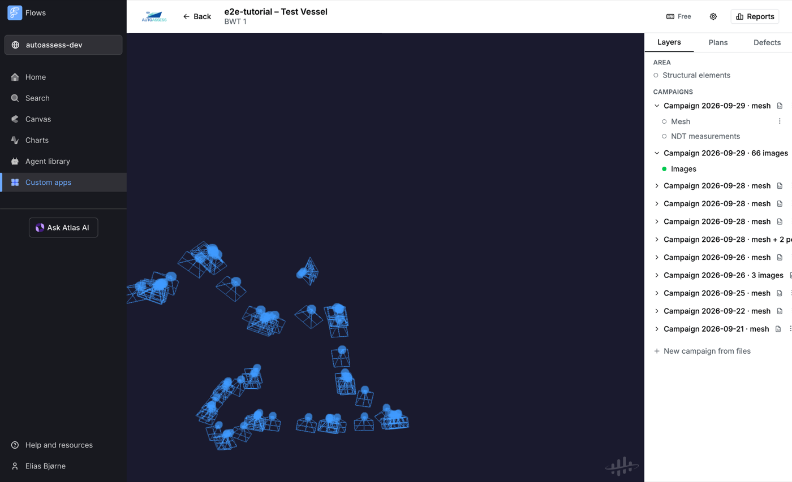
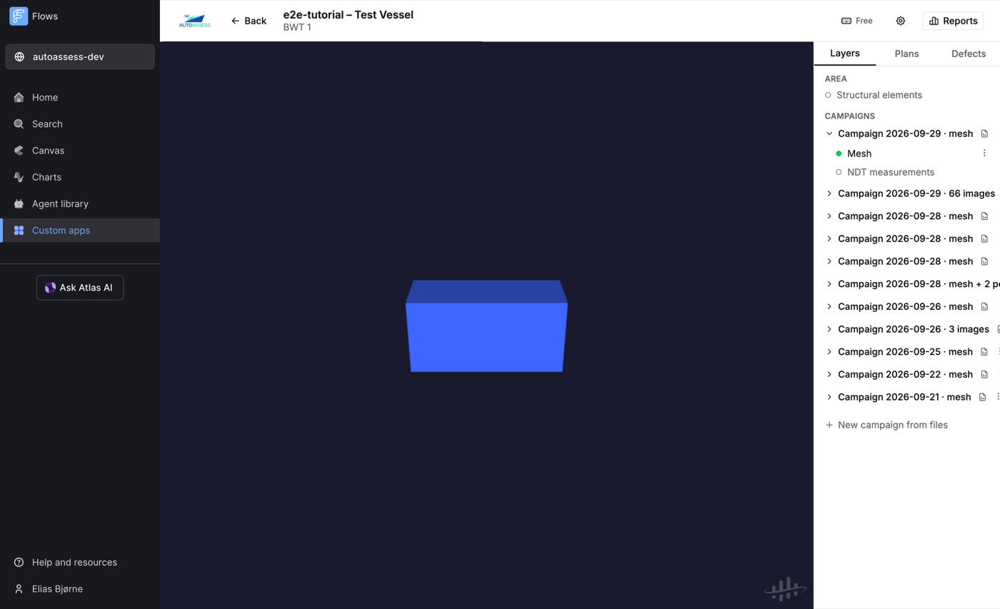
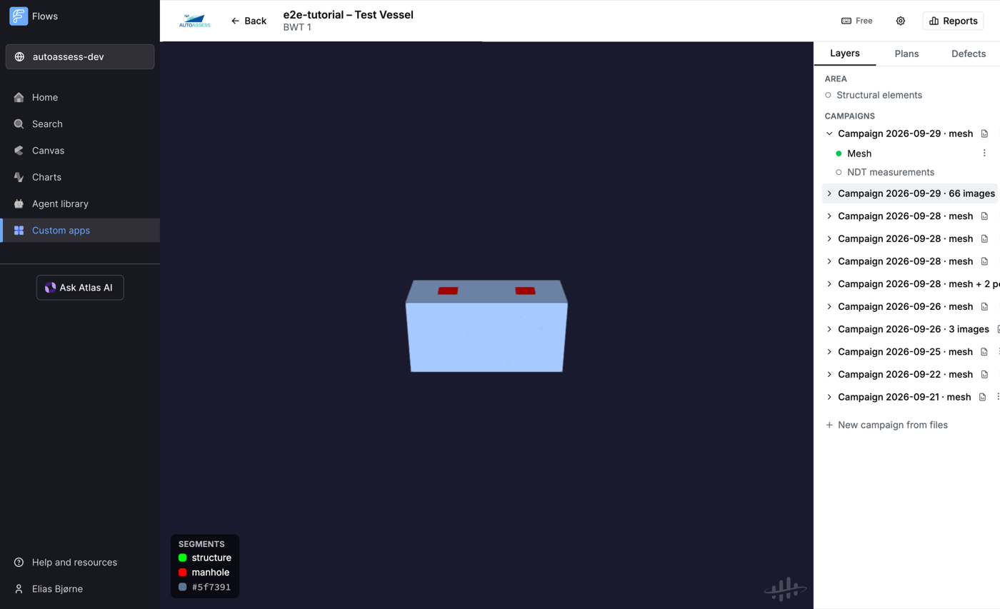
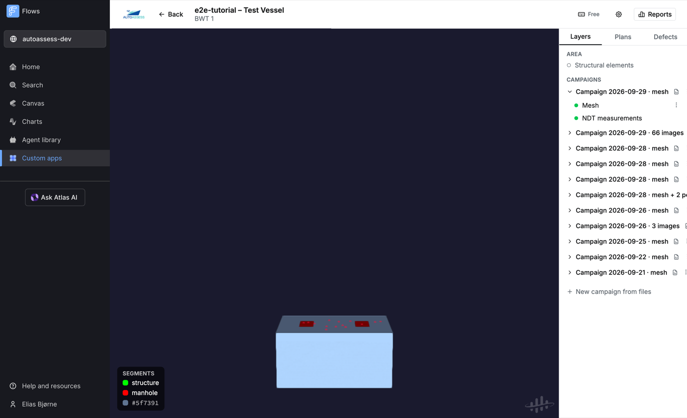
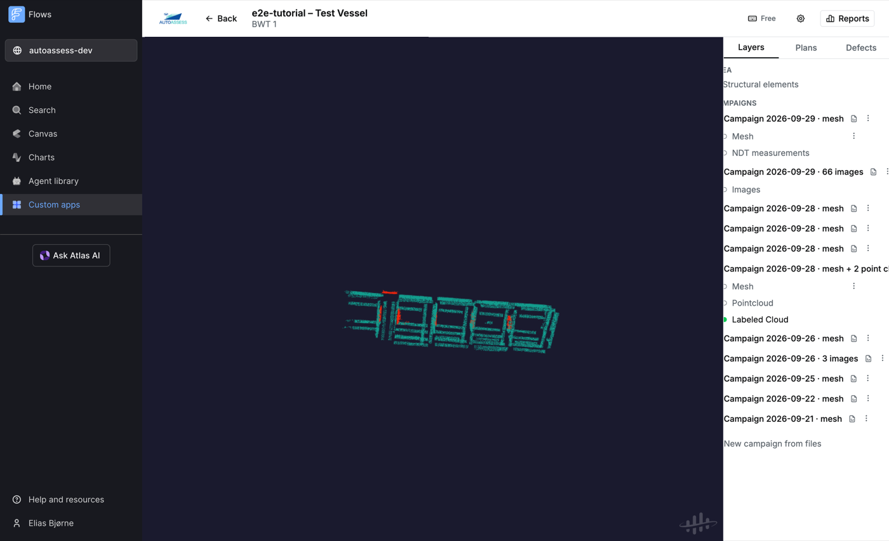

# 9. D6.2 data in the UI — what each file becomes, with pictures

This chapter shows what the D6.2 "dense geometric mapping" outputs (TUM, WP6) look like once they are in CDF and rendered by the AutoAssess viewer, using the `ship_CH` example dataset plus small synthetic samples where the dataset carries no example output yet. Every screenshot shows the real viewer.

## Interfaces in the stack

Everything meets in the CDF data model; each interface below is a client of that one contract.

| Interface | Who uses it | What it does | Where |
| --- | --- | --- | --- |
| **CDF data model** (space `autoassess`) | everything below | The contract: plans, tasks, campaigns, structural elements, defects, NDT, 3D models. Authoritative in `src/shared/cdf/dataModel.ts`, mirrored in `sdk/src/uidss/cdf/data_model.py` | [Chapter 2](02-data-model.md) |
| **Web viewer** (Flows app in Fusion) | inspectors | Author plans, review campaigns and defects, 3D viewing — the only human interface | [Chapter 5](05-web-viewer.md) |
| **`dss` SDK + CLI** (Python, `sdk/`) | ground station, pipelines | Plans down (`dss plan download`), mission artifacts up (`dss campaign upload`), automatic 3D models (`dss worker`), findings CSV → plan | [Chapter 4](04-ground-station-sdk.md) |
| **`autoassess_bridge` ROS node** | the robot | CDF ⇄ ROS: publishes the Ready plan, uploads the mission, stores findings as defects | [gbplanner_ros branch `gbplanner_ros-autoassess`](https://github.com/omkarsawant99/gbplanner_ros/tree/gbplanner_ros-autoassess) |
| **Drone Sandbox** (Flows app, `sandbox/`) | partners without ROS | Browser twin of the SDK and the bridge topics, with a simulated drone and planner | `sandbox/README.md` |
| **File contracts** | robot ⇄ ground station | `plan.json`, NDT CSV, PLY/PCD, TUM image datasets, `mesh_legend.json` | this chapter + [Chapter 4](04-ground-station-sdk.md) |

The bridge's ROS surface uses typed messages (`rosmsg show autoassess_bridge/…` documents every field; the bridge README has the per-field tables):

| Topic / service | Type | Meaning |
| --- | --- | --- |
| `/autoassess/plan` | `autoassess_bridge/InspectionPlan` (latched) | the plan: ids, name, area/map, `InspectionTask[]` with typed task/inspection kinds, position, normal, radius |
| `/autoassess/plan_json` | `std_msgs/String` (latched) | the verbatim `plan.json` text for consumers wanting full fidelity |
| `/autoassess/inspection_targets` | `geometry_msgs/PoseArray` | one inspection pose per task, in task order |
| `/autoassess/plan_id` | `std_msgs/String` | the plan's externalId |
| `/autoassess/findings` | `autoassess_bridge/Finding` (in) | one finding per message; stored as defects on the mission's campaign |
| `/autoassess/findings_json` | `std_msgs/String` (in) | the JSON findings interface, kept for the sandbox twin and scripts |
| `/autoassess/upload_status` | `autoassess_bridge/UploadStatus` (latched, out) | upload state machine (IDLE/EXPORTING_MESH/UPLOADING/COMPLETE/FAILED), counts, defect ids |
| `/autoassess/upload_status_json` | `std_msgs/String` (latched, out) | full JSON mirror with per-file details |
| `~upload_mission`, `~submit_findings` | `std_srvs/Trigger` | manual upload / findings retry |

`autoassess_full.launch` also starts a `dss worker`, so mission meshes get their 3D models built automatically.

Which plan does the bridge send down? The rule, in order: the area's plan with status **Active** (set explicitly in the viewer), otherwise the **newest-edited Ready** plan. The viewer badges the plan this rule selects, and the bridge republishes only when that plan's content actually changes (topics are latched, so late-starting nodes still receive it).

## One area = one physical space = one coordinate frame

Everything in an area renders in a single shared frame: meshes, point clouds, drone images, NDT points, structural elements, plans. Upload two datasets with different origins into the same area and they will float next to each other like debris — the viewer is doing exactly what it was told. Rules of thumb:

- One vessel compartment (or one Gazebo world, or one mapping session's frame) = one area.
- Everything uploaded to that area must be in that frame. The D6.2 pipeline already registers mesh, NDT and defects into one global map frame, so a mission's outputs belong together in one area.
- Keep test or demo data in its own area (or delete it when done), otherwise it pollutes every screenshot and demo of that area.

Two more things that confused us so you don't have to:

- **"Defects" means two things.** The right-panel *Defects tab* lists ML defect detections for review. The mesh's colour mode (⋮ menu on the Mesh layer → **Segments**) paints the mesh by its per-face classes. The segment legend only appears in that mode.
- **"3D model not ready yet"** simply means no `dss worker` has built a CDF 3D model for a campaign's mesh yet (chapter 4). If it never goes away, the mesh is failing to convert — run `dss campaign build-3d-model --campaign <id>` to see the error.

## Dataset map: D6.2 file → UI

| D6.2 output | Ingest | Shows up as |
| --- | --- | --- |
| TUM-RGBD dataset (`rgb/`, `rgb.txt`, `groundtruth.txt`, `intrinsics.txt`) | `dss campaign upload` (drone images; a bare 3×3 `intrinsics.txt` works — PR #20) | Camera frustums along the flight path; click one to open the photo |
| Fused semantic mesh from `app[mesh_path]` (PLY, per-face class colours) | `dss campaign upload` + worker/`build-3d-model` (segment legend + default palette — PR #21) | Streamed campaign mesh; **Segments** colour mode shows classes + legend |
| `ut_global_registered.csv` (timestamp s, thickness mm — PR #22) | `dss campaign upload` (auto-detected by header) | Magenta NDT spheres on the surface; click for thickness |
| `ut_measurements_colored.ply` (vertex-only coloured PLY) | `dss campaign upload` (converted to coloured PCD — PR #19) | A coloured point cloud layer under the campaign |
| `index-2d3d.csv` (3D point ↔ pixel ↔ defect id) | not ingested yet | future: DefectDetection seeds for the Defects tab |
| `mask/` defect masks | consumed on the robot by the fusion pipeline | arrive indirectly via the mesh's face classes |

## Drone images (real `ship_CH` data)

Every 25th frame of the real TUM dataset, uploaded with its true trajectory poses. Each image is a small light-blue sphere with a camera-frustum wireframe; the trajectory is readable directly from the frustums.

Up close, each pose is a sphere at the camera position plus its viewing frustum. Clicking a sphere opens the photo in the side panel (enlargeable), and hovering pixels in the photo casts a ray into the 3D scene, so you can locate what the camera saw.

Note: the dataset's `groundtruth.txt` poses are camera-frame; with no `sensor.yaml` the importer assumes identity extrinsics and says so in its log.

## Semantic mesh + segment legend (synthetic until TUM sends a mesh)

**The shared `ship_CH` zip contains no mesh.** It holds the *inputs* (images, depths, masks, trajectory); the fused, defect-painted mesh is the *output* of TUM's supereight2 pipeline, and no example output is distributed with the dataset. The tank below is synthetic, built only to show the mechanics — the red patches are painted with the manhole colour and the green strips with the structure colour of the default palette.

A mesh loads in **Colorization** mode: baked camera texture, or flat blue when the mesh has none (like this synthetic one):

Switch the Mesh layer's ⋮ menu to **Segments**:

Faces are now painted by class, and the legend appears bottom-left. Named classes come from `mesh_legend.json` next to the PLY, or from the default palette (pure red = manhole, pure green = structure); unmatched colours keep a hex swatch:

## NDT thickness (synthetic sample, real format)

The dataset ships no `ut_global_registered.csv` either, so these 14 points are synthetic — but in the exact D6.2 format (epoch-second timestamps, thickness in millimetres). Measurements render as small magenta spheres at their registered positions (here clustered on one tank wall, seen from outside); clicking one shows the thickness in mm:

## Coloured point clouds (real robot output)

Point clouds upload as PCD, one layer per file, named by the label you give at upload. A `label` field colours points by class (1 manhole, 2 longitudinal, 3 wall, 4 compartment — same colours as the structural elements). This one is real output from the bridge end-to-end run:

TUM's `ut_measurements_colored.ply` lands the same way: the SDK converts vertex-only coloured PLYs to coloured PCD on upload (PR #19), so its thickness colour-coding survives.

## Still needed from TUM

- An example **fused mesh** from `app[mesh_path]`, so the mesh section above can show real data.
- Confirmation that the **colour-per-class mapping is stable** between runs, ideally emitting `mesh_legend.json` so class *names* survive (we already ingest it).

Both are tracked in the compliance plan shared with the team.
